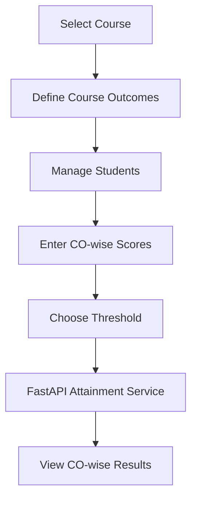
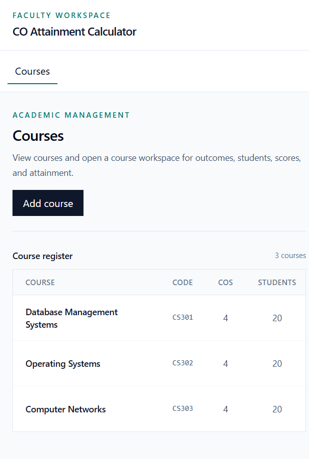
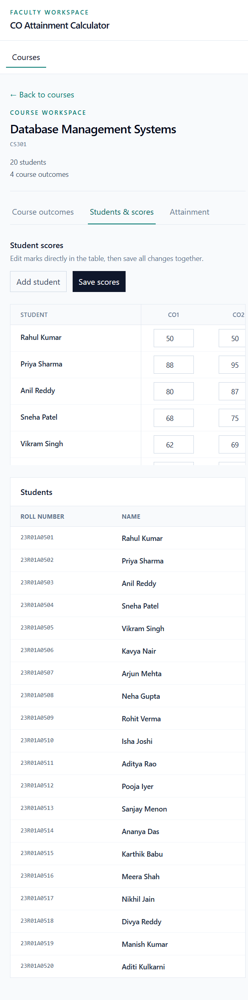
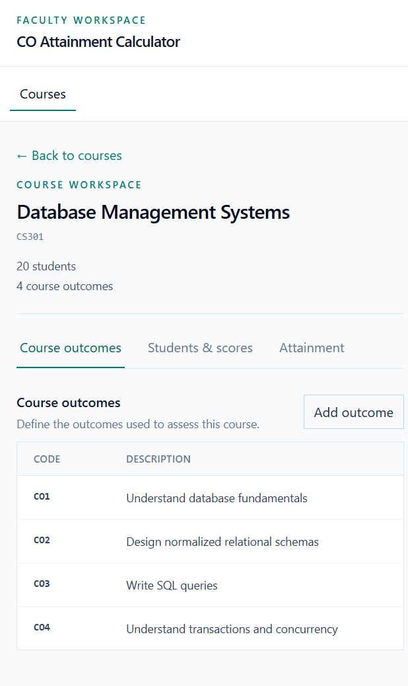
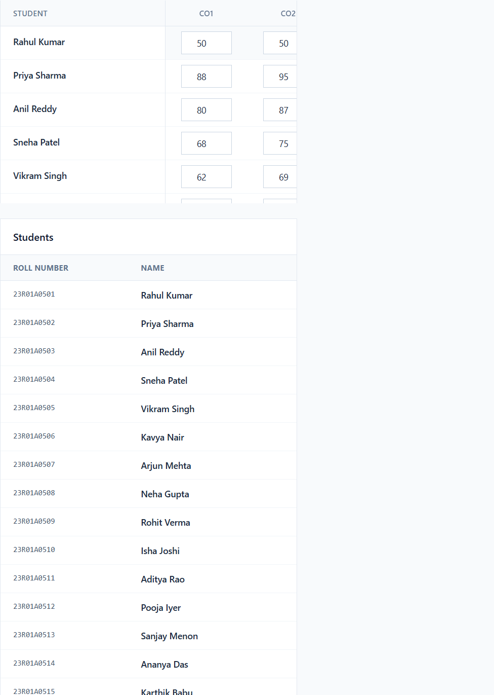
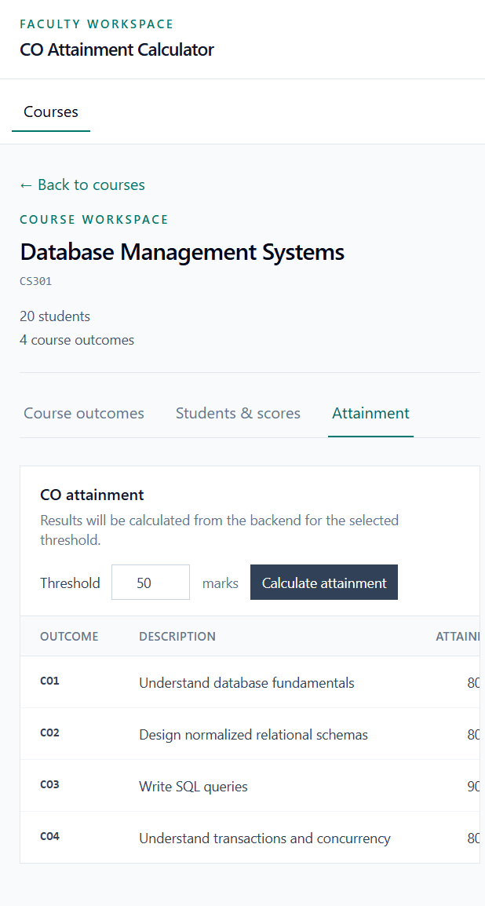

# Rubrix.ai Faculty CO Attainment Calculator

## Overview

The Rubrix.ai CO Attainment Calculator is a focused faculty tool for Outcome-Based Education (OBE). It gives faculty members one practical workflow for managing courses, defining Course Outcomes (COs), maintaining students, entering CO-wise marks, and reviewing threshold-based attainment.

This project implements the small, interview-friendly assignment scope rather than attempting to become a complete institutional ERP.

## Problem Statement

Faculty need a reliable way to record student performance against each Course Outcome and determine how many students meet a target score threshold. Manual spreadsheets make it easy to duplicate scores, mix courses, or apply inconsistent threshold logic.

The application keeps the workflow in one place and makes the backend the source of truth for persistence and attainment results.

## Solution

Faculty can:

1. Select a course.
2. Create, edit, and remove Course Outcomes.
3. Create, edit, and remove students for that course.
4. Enter or update marks in a compact CO-by-student table.
5. Choose an attainment threshold.
6. Request backend-calculated results for every CO.

## Key Features

- Course CRUD with real SQLite-backed data.
- Course Outcome CRUD scoped to a course.
- Student CRUD scoped to a course.
- Dynamic score-entry columns generated from the course's actual COs.
- Batch score saving with create, update, and delete handling.
- Score validation from 0 through 100.
- Backend-driven CO attainment calculation.
- Exact-threshold boundary behavior: `score >= threshold`.
- Seed data with 3 courses, 12 COs, 60 students, and 240 scores.
- FastAPI Swagger documentation.
- Pytest coverage for database, API, seed, and attainment behavior.
- Responsive Tailwind CSS interface designed for faculty data entry.

## Faculty Workflow



The first useful path is visible immediately: **Courses -> Open course -> Students & scores -> Attainment**.

## How CO Attainment Is Calculated

```text
Attainment % =
(number of students whose score >= threshold / total students) * 100
```

A student whose score is exactly equal to the threshold is counted as having met it. For example, scores `40, 50, 60` at threshold `50` produce `66.67%`.

The calculation lives in `backend/app/services/attainment.py`, independently from FastAPI and SQLAlchemy. The endpoint retrieves marks and delegates to that service. React only displays the returned result. Empty score collections safely return `0.0%`, and percentages are rounded to two decimal places.

## Screenshots

These screenshots were captured from the running application during the browser verification workflow.

### 1. Course Selection

The Courses screen loads the seeded courses and exposes the primary faculty actions.



### 2. Course Details

A selected course shows its identity, student count, CO count, and workflow sections.



### 3. Course Outcomes

Faculty can review CO descriptions and access create, edit, and delete actions.



### 4. Students

The student register provides a compact view of roll numbers, names, and management actions.


### 5. Score Entry

The score-entry table uses the course's actual COs as columns and keeps the student identity visible while scrolling.



### 6. Attainment Results

The attainment view sends the selected threshold to the backend and displays the returned percentage per CO.



## System Architecture

```text
React + Vite + Tailwind CSS
            │
            │ HTTP / JSON
            ▼
        FastAPI REST API
            │
            ▼
     SQLAlchemy + SQLite
```

- **Frontend:** React components manage view state, forms, loading states, and API calls through `frontend/src/services/api.js`.
- **API:** FastAPI routers expose CRUD and attainment endpoints with Pydantic request/response models.
- **Persistence:** SQLAlchemy models and SQLite store courses, outcomes, students, and scores.
- **Business logic:** The attainment service is isolated and unit tested.

## Database Design

```text
Course
 ├── Course Outcomes
 └── Students

Student + Course Outcome
           │
           ▼
         Score
```

- `Course` stores the course name and unique code.
- `CourseOutcome` belongs to one course and has a course-scoped code.
- `Student` belongs to one course and has a course-scoped roll number.
- `Score` connects one student to one Course Outcome and stores marks.
- `(student_id, co_id)` is unique, so one student has one current score per CO.
- Deleting a course, student, or CO cascades to dependent scores where appropriate.

## Technology Stack

### Backend

- Python 3.10+
- FastAPI
- SQLAlchemy
- SQLite
- Pydantic
- pytest

### Frontend

- React
- Vite
- Tailwind CSS
- Native `fetch`
- Playwright/browser verification

## API Overview

The backend uses the `/api` prefix.

### Courses

```text
POST   /api/courses
GET    /api/courses
GET    /api/courses/{course_id}
PUT    /api/courses/{course_id}
DELETE /api/courses/{course_id}
```

### Course Outcomes

```text
POST   /api/courses/{course_id}/outcomes
GET    /api/courses/{course_id}/outcomes
GET    /api/outcomes/{co_id}
PUT    /api/outcomes/{co_id}
DELETE /api/outcomes/{co_id}
GET    /api/outcomes/{co_id}/attainment?threshold=50
```

### Students

```text
POST   /api/courses/{course_id}/students
GET    /api/courses/{course_id}/students
GET    /api/students/{student_id}
PUT    /api/students/{student_id}
DELETE /api/students/{student_id}
GET    /api/students/{student_id}/scores
```

### Scores

```text
POST   /api/scores
GET    /api/scores/{score_id}
PUT    /api/scores/{score_id}
DELETE /api/scores/{score_id}
GET    /api/outcomes/{co_id}/scores
```

Swagger documentation is available at `http://127.0.0.1:8000/docs` when the backend is running.

## Project Structure

```text
project/
├── backend/
│   ├── app/
│   │   ├── database.py
│   │   ├── main.py
│   │   ├── models.py
│   │   ├── schemas.py
│   │   ├── seed.py
│   │   ├── routes/
│   │   └── services/
│   ├── tests/
│   ├── requirements.txt
│   └── pyproject.toml
├── frontend/
│   ├── src/
│   │   ├── components/
│   │   ├── pages/
│   │   ├── services/api.js
│   │   └── App.jsx
│   ├── package.json
│   └── vite.config.js
├── docs/
│   └── screenshots/
├── .gitignore
└── README.md
```

## Running the Project Locally

### Backend

Python 3.10 or newer is required.

```powershell
cd backend
python -m venv .venv
.\.venv\Scripts\Activate.ps1
pip install -r requirements.txt
python -m app.seed
uvicorn app.main:app --reload
```

The seed command creates the SQLite tables if needed and is idempotent. Running it again does not duplicate the seeded dataset.

Backend URLs:

- API: `http://127.0.0.1:8000/api`
- Swagger: `http://127.0.0.1:8000/docs`

### Frontend

Node.js and npm are required.

```powershell
cd frontend
npm install
npm run dev
```

Open `http://localhost:5173/` in a browser. The frontend uses `VITE_API_BASE_URL` when provided and otherwise defaults to `http://localhost:8000/api`.

## Testing

### Backend tests

```powershell
cd backend
python -m pytest
```

The suite covers database relationships and constraints, API CRUD behavior, seed idempotence, attainment edge cases, and the exact-threshold boundary.

### Browser verification

The final workflow was verified against live FastAPI and Vite processes using browser automation. It covered course loading, course navigation, dynamic score columns, score edit/save/refresh persistence, threshold changes, attainment results, and temporary CO/student CRUD with confirmation-based deletion.

## Seed Data

The deterministic seed contains:

- 3 courses: CS301, CS302, and CS303.
- 4 Course Outcomes per course.
- 20 students per course, 60 total.
- 240 scores, one for every student/CO combination.
- High, average, low, and exact `50` score cases.

Run `python -m app.seed` from `backend` to initialize it.

## Design Decisions

- SQLite keeps local setup lightweight for a small assignment.
- SQLAlchemy owns persistence and relationships instead of raw SQL.
- Pydantic defines API contracts and validates score ranges.
- FastAPI provides REST endpoints and Swagger documentation.
- Attainment is isolated in a service so it can be tested without a server or database.
- The backend remains the source of truth for official attainment values.
- React state and small focused components are sufficient for this workflow; no Redux or Zustand is needed.
- Tailwind styling prioritizes wide, readable tables and repeated faculty data entry over decorative dashboard elements.

## Completed Requirements

- FastAPI backend with SQLite and SQLAlchemy.
- CRUD APIs for Course, CourseOutcome, Student, and Score.
- Deterministic seed data.
- Isolated attainment calculation with exact-threshold pytest coverage.
- React/Vite/Tailwind faculty application shell.
- Connected course, CO, student, score, and attainment workflow.
- Loading, error, empty, validation, and confirmation states.
- Responsive table-oriented UI.
- Browser workflow verification and repository screenshots.

## Not Implemented

- Authentication and role management.
- Docker or deployment configuration.
- CSV/Excel import and export.
- Advanced analytics dashboards.
- Database migrations beyond simple SQLite table initialization.

## Future Improvements

- Faculty authentication.
- CSV/Excel bulk score import.
- Exportable attainment reports.
- Course-level and program-level OBE reports.
- Advanced OBE analytics.
- Deployment configuration and Docker Compose.

## Assignment Reference

This repository is the Round 1 Software Engineering Intern assignment implementation for Rubrix.ai. It focuses on a clean, explainable faculty workflow and the required CO attainment calculation.
